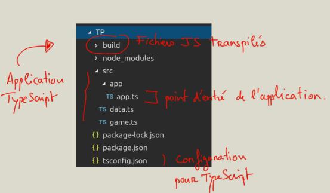
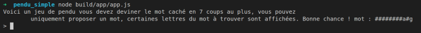
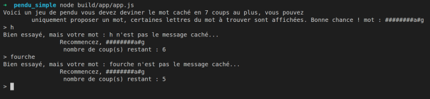
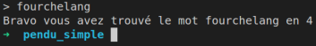

# TypeScript

### Sujet 

Dans un premier temps nous vous proposons le développement d’un jeu du
pendu en version simplifiée. On vous donne une structure de fichiers et dossiers
et du code pour commencer celui-ci.

Le jeu consistera à deviner un mot partiellement caché en un maximum de 7
coups.

Créez une constante enum pour la gestion du Status dans le jeu ; définissez par
exemple 3 constantes : Progress, Loser et Winner.

Dans cet exercice nous utiliserons Node pour rendre interactif le jeu en console.

En fin de document vous avez un exemple détaillé de fonctionnement de ce jeu.

On propose, si vous avez le temps, un exercice facultatif plus complet et donc
plus complexe à réaliser à la fin de ce document.

**Prérequis techniques : Node et npm doivent être installés sur vos
machines.**

## Mise en place de l’exercice 

Vous devez avoir le module TypeScript d’installé sur vos machines, si ce n’est
pas déjà fait tapez la ligne suivante :

```bash
npm install -g typescript
```

Récupérez les sources pour commencer le jeu et tapez dans la console (nous
installons les définitions de types Node pour TypeScript) :

```bash
npm install
```

Une commande permet également d’installer cette dépendance, dans le cas où
vous auriez un fichier package.json :

```bash
npm install --save @types/node
```

Pour compiler (transpiler) le code vous devez utiliser la commande suivante :

```bash
tsc -w
```

## Présentation de la structure des dossiers et fichiers



Dans le fichier app.ts dans les sources nous vous avons écrit la partie flux, à vous
de mettre toute la logique dans le jeu.

## Comment interagir avec la console

Voyez le code dans le fichier app.ts du dossier source pour commencer le jeu.

## Les données du jeu et définition de classe

La classe Word permet de définir un type que nous utiliserons dans la constante
MockWords, le typage ici indique que cette constante est un tableau de Word :

```typescript
export class Word {
    word: string;
    hide: string;
}

export const MockWords: Word[] = [
    { word: "cornedrue", hide: "#o######e" },
    { word: "cognards", hide: "c######s" },
    { word: "fourchelang", hide: "########a#g" },
    { word: "gringotts", hide: "######tts" },
    { word: "hyppogriffes", hide: "####o######s" },
];
```

Vous importerez les données dans le fichier app.ts de la manière suivante, notez
**qu’il faut exporter les données avant de les importer** sans quoi vous ne
pourrez pas les exploiter dans le fichier app.ts, elles sont scopées dans le
module data.ts :

```typescript
import { MockWords } from  "../data";
```

## La classe Game

Vous ferez au minimum une classe pour implémenter la logique du jeu. Tout doit
être correctement typé.

Instance de la classe Game :

```typescript
let game = new Game(MockWords); // on passe les mots à l'objet Game pour initialiser le jeu
```

La méthode run de la classe Game est la méthode « centrale » qui permettra de
mettre une grande partie de la logique du jeu. 

## Variable enum Status

La variable Status est particulière, en effet nous avons fait le choix d’utiliser un
enum en TypeScript. Ce dernier permet de définir une collection de constantes,
nous l’utiliserons pour définir l’état du jeu :

```typescript
// Enum 
enum Status {
    Winner,
    Loser,
    Progress,
}

let something: Status; // définition d'une variable  de type Status
something = Status.Winner; // on assigne une valeur

// Pour la comparaison utiliser l'alias "as" sinon erreur de type lors de la transpilation
// vers le code JS
Status.Progress as Status == something;
Status.Winner as Status == something;
Status.Loser as Status == something;
```

## Le fichier app.ts

C’est le boostrap de votre application, vous testerez le jeu en console à partir de
ce fichier.

## Exemple d’interaction dans la console 

Lancer le jeu en console



On peut alors proposer des mots pour deviner le mot caché :



Une fois le mot deviné le jeu s’arrête :



## Partie facultative

Vous pouvez améliorer le jeu en proposant les options suivantes, dans ce cas
créez un autre dossier pendu_optionals :

- Donnez la possibilité de choisir des lettres ou des mots.
- Enregistrez dans une classe Player ou User le pseudo et le score d’un
  joueur et donnez la possibilité de rejouer.
- Mémorisez les lettres déjà jouées et si l’utilisateur propose la même lettre
  ne pas décompter les coups avant arrêt du jeu.
- Créez une méthode permettant de cacher le mot automatiquement (dans
  ce cas retirez l’attribut hide dans la classe Word).