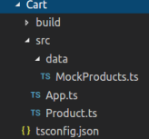

# Enum et Type generic

## Enum ou collection de constantes.

Un enum est un moyen de définir un ensemble de constantes nommées. Vous pouvez également utiliser
un enum pour définir le type d’une variable par exemple un Status :

```typescript
enum Status {
    Published,
    Unpublished,
    Draft
}

let state : Status;
state = Status.Draft;
```

## Le typage générique

Il permet de définir un type générique que l’on précisera a posteriori. Il permet de paramétrer le typage
pour les fonctions, classes ou interfaces. C’est lors de l’appel d’une classe, interface ou fonction que
l’on définira explicitement le type noté par convention **T**. Voyez l’exemple qui suit (testez-le) :

```typescript
// typage générique
function fusion<T>(a: T[], b: T[]): T[] {
    return a.concat(b);
}

let c = fusion(['a', 'b', 'c'], ['d', 'e']);
console.log(c) // affichera ['a', 'b', 'c', 'd', 'e']
```

## Exercice 5.1

Implémentez une **Queue** en définissant une classe et en utilisant le typage générique. Voici comment
dans le script courant vous devez appeler votre code pour ajouter un élément dans la queue et récupérer
le premier élément de la queue (une queue est l’inverse d’un array en JS) :

```typescript
let queue = new Queue<number>();
queue.push(1);
queue.push(2);
queue.push(3);
queue.push(4);

console.log(queue.pop()) // affiche 1

let queueArray = new Queue<Array<number>>();
queueArray.push([1, 2]);
queueArray.push([3, 4]);
queueArray.push([5, 6]);
queueArray.push([7, 8]);

console.log(queueArray.pop()); // affiche [1,2]
```

## Exercice 5.2

Voici la structure que l’on vous propose d’utiliser pour cet exercice.



Vous allez récupérer le code source de ce dernier dans le dossier **Source/05.2_Exercice_source**. 
Il ne vous restera plus qu’à faire un ```tsc -w``` en console pour compiler le code en continu :

Nous avons défini une classe **Product** particulière avec les types génériques. Dans le fichier
**MockProducts.ts** vous trouverez les données d’exemple pour cet exercice et les types du projet.

Vous devez dans un premier temps récupérer les détails et les delivery en fonction des id des produits et
mettre l’ensemble des produits dans le tableau suivant :

```typescript
let products: Array<Product<Details, Delivery>> = [];
```

Puis vous devez mapper ce fichier pour en extraire uniquement les produits dont l’option est « special »
pour Delivery.

Affichez le résultat en console.

Indications : Cet exercice est une application un peu avancée du typage générique, prenez le temps de
bien analyser le type de chaque élément. Vous pouvez utiliser les fonction forEach et map de JS.