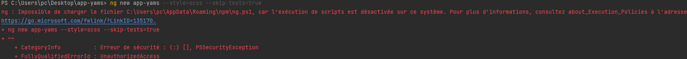
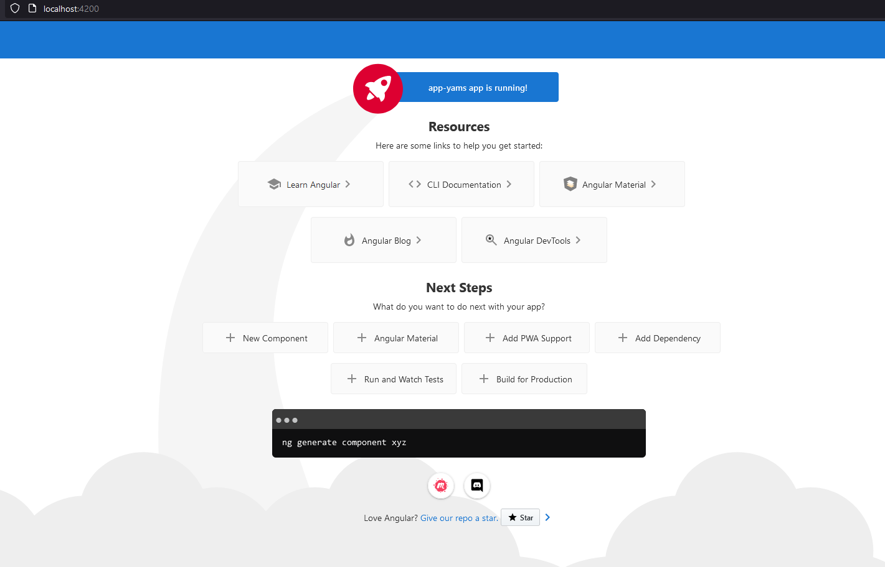
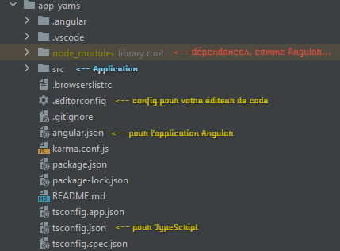
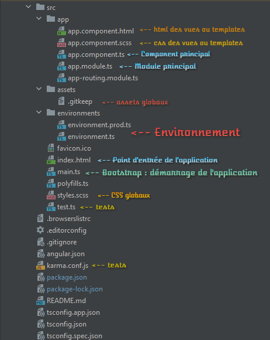
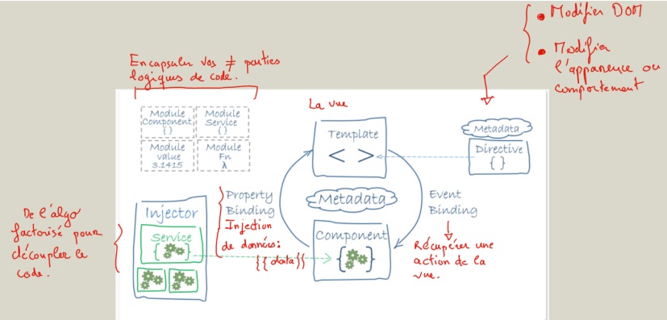
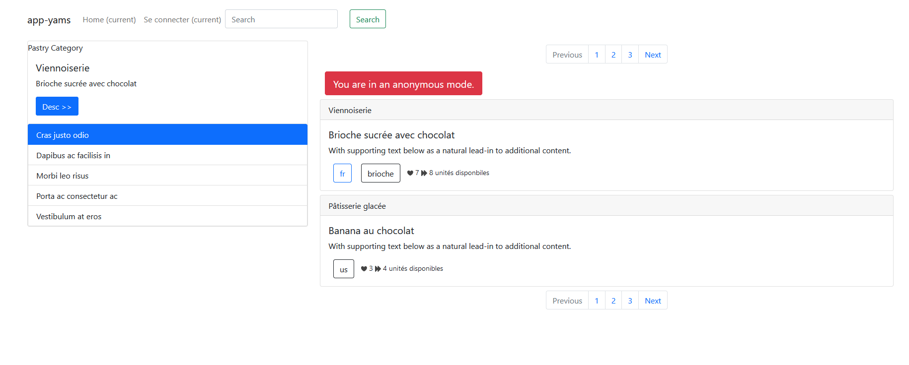

# Projet Application fil rouge : app-yams

Vous allez développer une petite application de *yams* qui vous permettra de gagner des lots de pâtisseries.
L'application contiendra un catalogue des lots (pâtisseries) ainsi qu'un petit moteur de recherche.

On développera également un espace sécurisé pour administrer le catalogue en
mettant en place un CRUD (create/read/update/delete).

Une fois terminée on verra comment déployer l’application sur un serveur distant.

Cette application sera notre fil rouge pour découvrir les concepts fondamentaux
d’*Angular*.

## Installation & configuration

### Installation d'Angular

Vous allez tout d’abord installer Angular dans un dossier `app-yams` créé sur votre bureau. 

Pour créer un nouveau projet **Angular** il faut dans un premier temps installer sur votre machine le package `angular-cli`, qui est un outil en ligne de commandes qui nous aidera à créer les fichiers, compiler et déployer l’application :

```bash
npm install -g @angular/cli
```


*ou plus simplement :*

```bash
npm i -g @angular/cli
```

Dans un terminal vous allez taper la commande :
```bash
ng new app-yams --style=scss --skip-tests=true
```

Cela va créer un dossier `app-yams` et télécharger les sources du framework **Angular** et de l’application.

Nous allons choisir une installation :

* Avec la gestion des `scss`.
* Sans la gestion des *tests unitaires* pour l’instant.
* Sans le système de routage.

Bien entendu, sur un nouveau projet, vous accepterez d'ajouter le **routing angular**.

**Remarques** : *si vous souhaitez de faire une installation standard saisissez simplement la commande :*

```bash
ng new app-yams
```

### Problèmes possibles

Si jamais vous veniez à rencontrer cette erreur sous Windows :



Tout ce que vous aurez à faire est de :

- Démarrer **Windows Powershell, en tant qu’Administrateur**.
- Taper la commande suivante :
  ```bash
  set-executionpolicy unrestricted
  ```
  
Puis, vous pourrez relancer une installation du projet.


### Démarrer le serveur de test.

**Angular-cli** est un outil en ligne de commande, il va vous permettre de créer, compiler et mettre en production votre application. 

**C’est un outil indispensable.**

Pour compiler les modifications et lancer l’application en temps réel, tapez la ligne de commande suivante, **Angular** lancera un serveur de test sur le port `4200` :

* *Commande standard :*

```bash
ng serve -o
```

* *Commande équivalente avec une option pour changer le port :*

```bash
ng serve -o --port 4300
```

Une fois cette commande lancée vous devriez avoir dans votre navigateur par défaut la page suivante qui s’affiche :



## Présentation des dossiers et fichiers Angular



## Les dossiers de l’application src



## Architecture de l’application

**Angular** est construit à partir de components hiérarchiques écrits en **TypeScript** :

Ce sont les « *contrôleurs* » de l’application. Chaque `Component` possède sa propre vue et ses propres `CSS` qui sont par défaut isolés (portées des CSS) dans le component lui-même.

Les `modules` encapsulent (isolent) les Components dans des unités logiques de votre application : partie publique du site ou partie privée, page d’inscription,
etc.

Les `services` séparent la logique du code des Components, ils sont factorisables et réutilisables dans l’application. 

On fera de l’**injection de dépendance** pour
consommer un service unique dans les `Components`.

Les `directives` agissent sur les données dans les **templates**.

Les équipes de développement d’Angular propose un schéma détaillants cette architecture :



## Installation des CSS ou SCSS

Pour l’instant on ne veut pas se soucier de la mise en page de notre application, nous installerons simplement  `Bootstrap`, une librairie `CSS` :

* Installation local des CSS (dossier *node_modules*)

```bash
npm install bootstrap --save
```

Puis dans la partie (clé) `architect` du fichier `angular.json` du dossier `app-yams`
de l’application ajoutez la ligne suivante :

```json
"styles": [
"src/styles.scss",
"./node_modules/bootstrap/dist/css/bootstrap.min.css"
],
"scripts": []
},
```

Arrêtez votre serveur local en tapant la commande `CTRL + C`.

Puis, relancez le serveur local :

```bash
ng serve -o
```

## Structure de la page principale de notre application

La **page principale** listera les pâtisseries à gagner.

Dans le menu principal on pourra aller sur la page de connexion.

Le **Dashboard** ne sera joignable qu'une fois authentifié sur l'application.

Un lien de déconnexion **logout** sera utilisable pour se déconnecté.


## A FAIRE

* Récupérez les sources du projet de ce chapitre.

La partie *HTML* est à récupérer dans le fichier `app.html`, elle vous sert d’exemple.

Nous l’utiliserons dans les différents components qui structurent notre application au fur et à mesure pour structurer la/les page(s).

**Ne recopiez pas le code HTML dans app.component.html pour l’instant.**



Fin de ce chapitre, merci de l’avoir suivi.