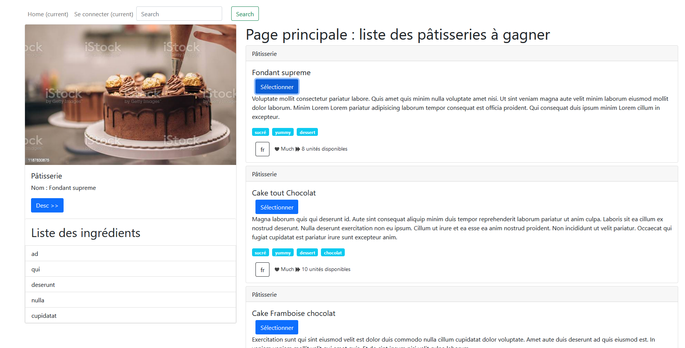

# Composant :  détails des pâtisseries

Nous allons maintenant voir comment communiquer dans un autre sens, entre la **vue** et le **code TypeScript**, c’est-à-dire du `Template` vers le `Component` (code *TypeScript*). C’est de l’**Event data binding**, c’est du **one-way** également. 

Il va nous permettre de réagir en fonction d’un événement dans la page Web.

## Exercice 10 (détails d’une pâtisserie)

Dans cette partie nous allons “câbler” les deux Components `PastriesComponent` et `PastrieDetailsComponent` afin qu’ils puissent communiquer entre eux. 

**L’exercice 11** permettra de finaliser l’affichage des détails d’une pâtisserie, c’est-à-dire la liste de ses ingrédients.

L’événement `(click)` sera placé dans l’élément `div.card`. 

* Créez un bouton cliquable.
  
Ainsi en sélectionnant une pâtisserie dans l’application on récupèrera une `pastrie` dans le *TypeScript*.

* Définissez une méthode `onSelect` dans le TypeScript. 
* Faites un `console.log` pour contrôler que tout fonctionne bien.


**Affichage d’une pastrie dans la partie div.col-sm-4.**

* Créez un autre Component `PastrieDetailsComponent`. Ce sera un component
enfant du component `PastriesComponent`. C’est dans ce dernier que vous
afficherez le détail d’une pâtisserie.


```bash
ng g c pastrie-details
```

**Communication du parent vers l’enfant** : 
lorsque vous sélectionnez une pâtisserie avec la méthode `onSelect(pastrie)` depuis le component `PastriesComponent` vous devez faire passer celui-ci (**one-way data binding**) au Component enfant `PastrieDetailsComponent`.

* Créez une variabe `selectedPastrie` dans le component `PastriesComponent`.
Lorsque vous sélectionnez une pâtisserie, cette dernière est assignée à cette variable.

Nous allons maintenant faire passer cette dernière à notre Component enfant `PastrieDetailsComponent`.

```angular2html
<div class="col-sm-4 video">
    <!-- PastrieDetails communication parent vers enfant -->
    <app-pastrie-details [pastrie]="selectedPastrie" ></app-pastrie-details>
</div>
```

La syntaxe `[pastrie]` permet de faire passer la variable `pastrie` au component enfant : c’est une « **property binding** », c’est du “**one-way in**”.

La propriété `pastrie` sera liée au Component enfant `PastrieDetailsComponent` comme suit (utilisation du décorateur `@Input()`,*attention à bien importer ce décorateur dans le component enfant*) :

```angularjs
// Component enfant
// la classe Input est nécessaire
import { Component, OnInit, Input } from '@angular/core';
import { Pastrie } from '../pastrie';

@Component({
    selector: 'app-pastrie-details',
    templateUrl: './pastrie-details.component.html',
    styleUrls: ['./pastrie-details.component.scss']
})
export class PastrieDetailsComponent implements OnInit {
    
    // Classe Input permet de récupérer les data de l'enfant
    // pastrie est liée à une entrée [pastrie] du parent dans le sélecteur
    @Input() pastrie: Pastrie;
    
    constructor() { }

    ngOnInit() {
        console.log(this.pastrie); // pour l'instant c'est undefined ... C'est normal
    }
}
```

Vous pouvez dans la vue du Component `PastrieDetailsComponent` afficher une pâtisserie sélectionnée avec **le pipe json**, uniquement pour pour du **débogage** :

```
{{ pastrie | json}}
```

Maintenant que vous savez comment récupérer une propriété depuis un Component **parent** vers son **enfant** :

* Affichez dans un premier temps la pâtisserie en respectant le visuel suivant : 
  
  

Vous penserez également à ajouter du CSS pour mettre le bon curseur lorsqu’on survole une pâtisserie cliquable, ou à ajouter un bouton pour sélectionner une pâtisserie, au choix. 

Faites bien attention à ce dernier point : **les CSS sont propres à un component donné**.

Ne vous occupez pas de l’aspect dynamique de la liste des pâtisseries pour l’instant.


## Exercice 11 (gestion des noms des pâtisseries)

Récupérez les données dans le component `PastrieDetailsComponent` afin d’afficher le détail des listes des ingrédients par pâtisserie. Chaque pâtisserie possède un identifiant unique « id ». 

Utilisez cette propriété dans cet exercice.


### Life cycle

C’est dans la méthode `ngOnChanges` du component `PastrieDetailsComponent` que l’on va récupérer la propriété `pastrie` du component **parent**. 

La méthode `ngOnChanges` est déclenchée à chaque fois que l’on clique sur une pâtisserie dans le component parent lié avec la propriété `[pastrie]` et à l’**instanciation** du component.

La liste des ingrédients de chaque pâtisserie devrait maintenant s’afficher en fonction de `ingredientsLists` et cela de manière dynamique.

## Exercice Bonus (ordre des ingrédients)

Dans le `PastrieDetailsComponent`:

* Créez une fonction `modifyIngredientsOrder` permettant changer l'ordre des éléments qui composent la liste des ingrédients (ordre *croissant* ou *décroissant*), en cliquant sur le bouton 
**Desc >>** (transformant celui-ci en bouton **Asc >>** et vice versa).