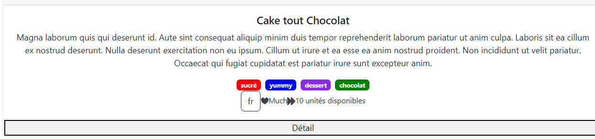

# Les Pipes

Nous allons créer un Pipe qui va permettre de formatter une entrée de notre template. 

Il existe des pipes natifs intégrés à Angular comme pour mettre un texte en majuscule ou pour formater une date. Je vous invite à vous référer à la documentation en ligne. 

Dans notre cas, nous allons créer un pipe personnalisé qui permettra d'appliquer une feuille de style de couleur à nos bagdes de "tags". 

```
ng generate pipe pastry-tag-color
```

Le `CLI` a créé un nouveau fichier nommé : `pastry-tag-color.pipe.ts`.

Dont le contenu par défault : 
```typescript
import { Pipe, PipeTransform } from '@angular/core';

@Pipe({
  name: 'pastrieTagColor'
})
export class PastrieTagColorPipe implements PipeTransform {

  transform(value: unknown, ...args: unknown[]): unknown {
    return null;
  }
}
```

Lorsque nous allons appliquer notre `pipe` , la méthode `transform` va recevoir la donnée que nous voulons formater ainsi qu'éventuellement des arguments. 

Dans notre cas, nous souhaitons que le pipe s'utilise ainsi dans le template : 

```html
<span class="badge {{tag | pastrieTagColor }}">
```

En fonction de la valeur de `tag`, le `pipe` retournera une valeur correspondant  un nom de class CSS donnant une propriété `background-color` différente. 

`Tag` est une chaine de caractère, et `pastrieTagColor` n'a pas d'autres arguments. 

Nous pouvons donc réécrire la méthode `transform` de la sorte : 

```typescript
import { Pipe, PipeTransform } from '@angular/core';

@Pipe({
  name: 'pastrieTagColor'
})
export class PastrieTagColorPipe implements PipeTransform {

  transform(tag: string): string {
    return "ma_classe_CSS";
  }
}
```

* Ecrivez la méthode `transform` afin qu'elle retourne un nom de classe CSS différent en fonction de la valeur de `tag`. 
Utilisez `switch`...`case`...`default`.

  **Ne pas oubliez de créer les classes dans le fichier `pastries.component.scss` également**

