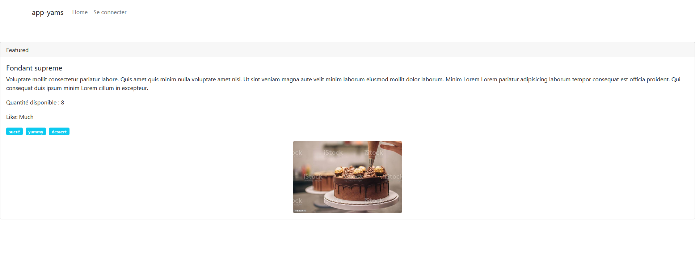
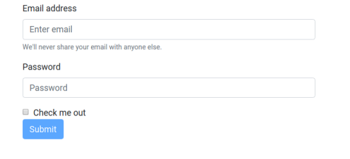

# Router

## Exercice 20 Mise en place du router et des nouvelles pages

Nous allons créer trois routes : une pour la page principale, une pour la page
affichant une pâtisserie (différent du détail d’une pâtisserie affiché à gauche) et enfin
une pour la page de connexion au backoffice que nous verrons plus tard.

### Pour la route PastrieDescription vous rendrez cliquable le nom de la pâtisserie.

Pour créer nos routes nous allons le faire dans l’AppModule pour l’instant, plus
tard nous factoriserons ce code dans un module spécifique.

Voyez le code ci-dessous dans le fichier app.modules.ts :

```angularjs
import { BrowserModule } from '@angular/platform-browser';
import { NgModule } from '@angular/core';
import { FormsModule } from '@angular/forms';
import { Routes, RouterModule } from '@angular/router';

import { AppComponent } from './app.component';
import { PastriesComponent } from './pastries/pastries.component';
import { PastrieDetailsComponent } from './pastrie-details/pastrie-details.component';
import { SearchComponent } from './search/search.component';

// définission de la constante pour les routes
const pastriesRoutes: Routes = [];

@NgModule({
    declarations: [
        AppComponent,
        PastriesComponent,
        PastrieDetailsComponent,
        SearchComponent
    ],
    imports: [
        BrowserModule,
        FormsModule,
        RouterModule.forRoot(pastriesRoutes), // chargement des routes dans l'application
],
providers: [],
    bootstrap: [AppComponent]
})
export class AppModule { }
```

Définissez les routes suivantes :

```angularjs
const pastriessRoutes: Routes = [
    {
        path: 'pastries',
        component: PastriesComponent
    },
    {
        path: '',
        redirectTo: '/pastries',
        pathMatch: 'full'
    },
    {
        path: 'login',
        component: LoginComponent
    },
    {
        path: 'pastrie/:id',
        component: PastrieDescriptionComponent
    },
];
```

Dans la navigation principale écrivez maintenant :

```angular2html
<ul class="navbar-nav mr-auto">
    <li class="nav-item active">
        <a class="nav-link" routerLink="/login" routerLinkActive="active">
            Se connecter
        </a>
    </li>
</ul>
```

Pour le lien (ou route) menant vers la page principale affichant toutes les pâtisseries,
notez que dans la constante pastriesRoute nous avons fait une redirection vers le
component affichant les pâtisseries pour cette route, c’est la directive routerLink
qui permet de faire la relation entre la route et la définition de celle-ci dans la
constante pastriesRoute.

Il faut maintenant placer dans le template app.component.html le sélecteur
permettant de charger les components une fois que l’on aura cliqué sur une route
du menu (si ce n'est pas déjà fait) :

```angular2html
<router-outlet></router-outlet>
```

Pour la page de description, il faudra rendre cliquable chaque nom de pâtisserie dans le
component HTML pastries.component.html :

```angular2html
<a class="text-info" routerLink="/pastrie/{{pastrie.id}}">{{pastrie.name}}</a>
```

Pour récupérer l’identifiant dans le component PastrieDescriptionComponent
vous utiliserez la classe Router et le code suivant :

```angularjs
import { Component, OnInit } from '@angular/core';
import { ActivatedRoute } from '@angular/router';
import { Pastrie } from '../pastrie';

@Component({
    selector: 'app-pastrie-description',
    templateUrl: './pastrie-description.component.html',
    styleUrls: ['./pastrie-description.component.scss']
})
export class PastrieDescriptionComponent implements OnInit {
    pastrie : Pastrie ;
    constructor(
        private route: ActivatedRoute, // récupérez le service route
        private pS: PastrieService // récupérez le service
    ) { }
        ngOnInit() {
            // permet de récupérer l'identifiant
            const id = this.route.snapshot.paramMap.get('id');
            // TODO récupérez le détail d'une pâtisserie
        }

}
```

La page correspondant au PastrieDescriptionComponent affichera le détail d’une pâtisserie.



Pour le formulaire de connexion affichez simplement pour l’insant le formulaire
suivant :

